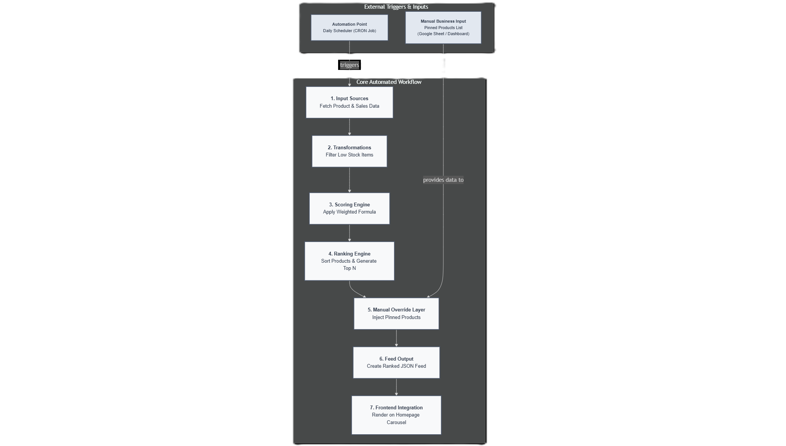

# AI-Powered Automated Merchandising Agent for E-Commerce

### Case Study for the AI Agent Automation Engineer Role at SkinSeoul

This repository contains the solution for the case study challenge presented by **SkinSeoul**. The project's objective is to design a fully-automated merchandising agent that dynamically ranks and curates products on an e-commerce website to drive key business metrics.

---

## 🚀 Live Demo

A functional prototype of the scoring and ranking engine has been built using Streamlit to provide an interactive demonstration of the agent's logic.

**[➡️ Launch the AI Merchandising Agent Prototype](https://ai-merchandising-agent.streamlit.app/)**

The prototype allows you to:
-   View the mock product dataset.
-   See the calculated scores for each product based on the defined algorithm.
-   Observe the final ranked list of "Best Sellers" that would be fed to the website's frontend.

---

## 🎯 Objective

The core goal was to design an intelligent system to automate onsite merchandising at SKINSEOUL. This AI agent would replace manual, static curation with a data-driven approach, aiming to:

-   🚀 **Boost conversion rates** by showcasing the most relevant and popular products.
-   📈 **Increase Average Order Value (AOV)** through strategic upselling and cross-selling.
-   ✨ **Enhance product and brand discovery** for customers.
-   ⚙️ **Reduce manual effort and eliminate curation bias**, freeing up the merchandising team to focus on high-level strategy.

---

## 🔍 The Solution: A Dynamic Ranking & Curation System

I have designed a conceptual AI agent that automates the curation of a key merchandising touchpoint: the **Homepage "Best Sellers" Carousel**. This high-visibility area was chosen for its significant impact on user engagement and initial conversion.

The system operates in four key stages:

### 1. Data Ingestion & Filtering

The agent begins by ingesting product data. Based on the provided mock dataset, the initial step involves applying a set of filtering rules to ensure only relevant products are considered for ranking.

-   **Stock Availability:** Exclude products with `Units in Stock < 10` to prevent featuring items that are likely to sell out quickly.
-   **Sales Velocity:** Filter out products with `Volume Sold Last Month < 20` to remove slow-moving items from a "Best Sellers" list.

### 2. Weighted Scoring Algorithm

At the heart of the agent is a weighted scoring function designed to balance multiple business objectives. Each eligible product is assigned a score based on the following formula:

$$
\text{Score} = (w_1 \cdot \text{Normalized Sales}) + (w_2 \cdot \text{Normalized Views}) + (w_3 \cdot \text{Brand Tier Multiplier}) + (w_4 \cdot \text{Normalized Profit Margin})
$$

Where:
-   **Normalized Sales & Views:** Prioritize products with proven popularity and high customer engagement.
-   **Brand Tier Multiplier:** Aligns curation with business strategy by assigning higher weight to partner brands (Tier A > Tier B > Tier C).
-   **Normalized Profit Margin:** Ensures that commercially valuable products are given prominence.

### 3. Automated Ranking & Output

Once scores are calculated, the agent ranks the products in descending order and outputs a top-N list (e.g., the top 10 products) in a machine-readable format like JSON. This process is designed to run on a set **refresh cadence** (e.g., every 24 hours) to keep the carousel fresh and relevant.

### 4. Process Flow & Manual Override

The entire workflow is designed for automation, from data input to frontend rendering. A crucial component is the **Manual Override Layer**, which allows the business team to manually pin specific products to the top of the list for strategic promotions or campaigns, providing a necessary balance between automation and business control.

> **Note**: For the image above to display correctly, place your image file `flow_map.png` inside an `assets` folder in this repository.

---

## 🛠️ Tools, Technologies & Assumptions

-   **Prototyping:** Streamlit
-   **Data Analysis & Simulation:** Python (with Pandas & Jupyter Notebook)
-   **Process Visualization:** The workflow map was designed using Lucidchart.
-   **Data Handling:** The mock data was processed using Google Sheets/Excel.
-   **Automation Assumption:** The system is designed to be triggered by a CRON script or an API call from an orchestration tool (e.g., n8n, Airflow).

---

## 📂 Repository Contents

This repository is organized as follows:

-   `app.py`: The Python script for the interactive Streamlit prototype.
-   `SkinSeoul_Case_Study.pdf`: The detailed 2-page PDF document.
-   `README.md`: This file, providing an overview of the project.

---

## 💡 Future Enhancements

This foundational system can be extended to create a more sophisticated AI merchandising platform:

1.  **Personalization Engine:** Integrate user data (browsing history, purchase data) to deliver a unique, 1:1 personalized "Best Sellers" list for each visitor.
2.  **A/B Testing Framework:** Implement an automated A/B testing module to continuously optimize the scoring algorithm's weights for maximum impact on conversion and AOV.
3.  **LLM-Powered Curation:** Utilize a Large Language Model (LLM) to dynamically generate compelling titles for the carousel (e.g., "Top-Rated Serums for Glowing Skin") based on the real-time product mix.
4.  **Real-Time Analytics:** Transition from a daily batch process to a real-time data stream to react instantly to trending products and flash sales.
